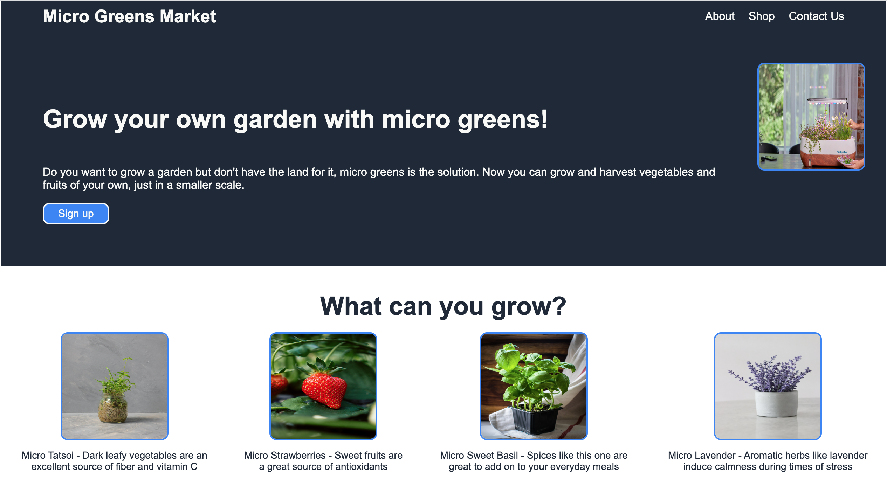

# Micro Greens Market Landing Page

### This is my first landing page for an imaginary market called "Micro Greens Market".

This project was completed as an assignment for The Odin Project intro to CSS and HTML basics course.The aim of the assignment was to build a website for an imaginary business using only CSS and HTML.There is no backend coding therefore, this website is unresponsive.

## Built With 

- HTML5
- CSS3

## Prerequisites

You will need a web browser to view this project. No set up required. Works best on:

- Firefox
- Google Chrome
- Safari

## Live Demo

<https://raybgomez.github.io/Landing-Page/>

Deployed on [GitHub Pages](https://pages.github.com/) 

### Usage

Click on the above live demo link to view the webpage for Micro Greens Market.

## Acknowledgement

HTML and CSS Basics lesson by [The Odin Project](https://www.theodinproject.com) 

## Contributing

Contributions, issues, and feature requests are welcome!

## Show your support

Show your love by hitting the ⭐️ button, I'd really appreciate it.
